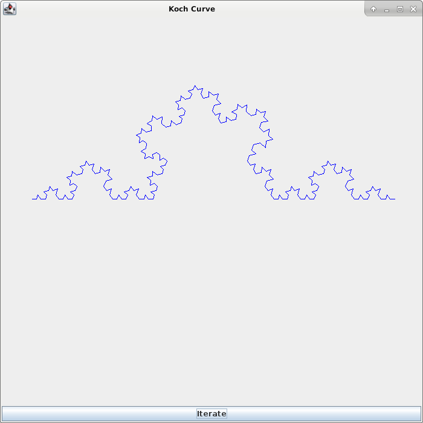

# Koch-Snowflake

Koch Snowflake (3rd Iteration)

Koch Snowflake (4th Iteration)

Koch Snowflake (6th Iteration)

Dependencies/Installation:

	Install the Java jdk of your choice (OpenJDK installation shown)

	sudo apt-get install openjdk-8-jdk
	
Compiling and Running Code:

	Compile:
	
	javac KochCurve.java
	
	javac Matrix.java
	
	javac MatrixException.java
	
	javac MatrixMultTest.java
	
	javac MTH215Project.java
	
	javac Points.java
	
	javac Project.java
	
	
	Run:
	
	java MTH215Project "<expression>"
	
	When prompted for a # of iterations, try numbers between 1 and 6
	
	e.g.
	
	java MTH215Project
	
	Enter the desired number of iterations: 6
	

	
